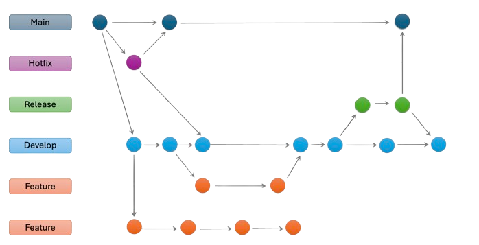

Branches
========

.. contents:: Branches Overview
   :depth: 3

Branches allow you to work on different versions of a repository at the same time.

===================
Main Branches
===================

.. note::
   The main branches are the default branches in a repository. These are **long-lived** branches.

main
-----

* Use ``main`` for your production-ready code.
* Contains the most stable code.

develop
-------

* The branch where you merge all feature branches.
* Use ``develop`` for your development code.
* Contains the most recent code changes.
* This branch is merged into the ``main`` branch.

===================
Supporting Branches
===================

.. note::
   Supporting branches are **short-lived** and are merged into the develop branch once the changes are complete.

feature/<feature-desc>
--------------------------

* Branches created for developing new features.
* Use feature branches to isolate changes for a specific feature.
* This branch is merged into the ``develop`` branch.

bugfix/<bug-desc>
--------------------------

* Branches created for fixing bugs.
* Rectify a bug in a separate branch to avoid affecting the main codebase.
* This branch is merged into the ``develop`` branch.

hotfix/<hotfix-desc>
--------------------------

* Branches created for fixing critical bugs in the production code.
* Use hotfix branches to fix bugs in the production code.
* This branch is merged into the ``main`` branch.
* The changes in this branch are also merged into the ``develop`` branch.

documentation/<doc-desc>
--------------------------

* Branches created for updating documentation.
* This branch is merged into the ``develop`` branch.

refactor/<refactor-desc>
--------------------------

* Branches created for refactoring code.
* Use refactor branches to improve the code quality without changing the functionality.
* This branch is merged into the ``develop`` branch.

release/<release-version>
--------------------------

* Branches created for preparing a release.
* Use release branches to stabilize the code for a release.
* This branch is merged into the ``main`` branch.
* The changes in this branch are also merged into the ``develop`` branch.

===================

